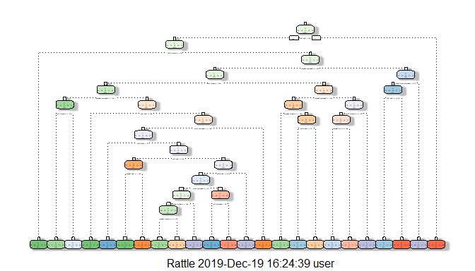

## Summary

Using devices such as [Jawbone Up](https://jawbone.com/up), [Nike Fuelband](https://www.nike.com/help/a/why-cant-i-sync), and [Fitbit](https://www.fitbit.com/) it is now possible to collect a large amount of data about personal activity relatively inexpensively. These type of devices are part of the quantified self movement – a group of enthusiasts who take measurements about themselves regularly to improve their health, to find patterns in their behavior, or because they are tech geeks. One thing that people regularly do is quantify how much of a particular activity they do, but they rarely quantify how well they do it. In this project, the data come from accelerometers on the belt, forearm, arm, and dumbell of 6 participants, who were asked to perform barbell lifts correctly and incorrectly in 5 different ways: exactly according to the specification (Class A), throwing the elbows to the front (Class B), lifting the dumbbell only halfway (Class C), lowering the dumbbell only halfway (Class D) and throwing the hips to the front (Class E). Class A corresponds to the specified execution of the exercise, while the other 4 classes correspond to common mistakes. The goal is to predict the manner in which they did the exercise.

## Data

The training and test data for this project are available [here](https://d396qusza40orc.cloudfront.net/predmachlearn/pml-training.csv) and [here](https://d396qusza40orc.cloudfront.net/predmachlearn/pml-testing.csv), respectively and the relevant paper of the study is the following:
  
Velloso, E.; Bulling, A.; Gellersen, H.; Ugulino, W.; Fuks, H. Qualitative Activity Recognition of Weight Lifting Exercises. Proceedings of 4th International Conference in Cooperation with SIGCHI (Augmented Human '13) . Stuttgart, Germany: ACM SIGCHI, 2013.

Moreover, detailed information about this project can be obtained from the following website: http://groupware.les.inf.puc-rio.br/har


```r
training <- read.csv("https://d396qusza40orc.cloudfront.net/predmachlearn/pml-training.csv", header = TRUE, na.strings=c("","NA"))
testing <- read.csv("https://d396qusza40orc.cloudfront.net/predmachlearn/pml-testing.csv", header = TRUE, na.strings=c("","NA"))
```

Before modelling, the original dataset is cleaned to make the model analysis easier. First, many variables have missing values (NAs). These are removed from the training and testing datasets:


```r
trcol <- dim(training)[2]
nacell <- data.frame(matrix(ncol = trcol, nrow = 1))
for (i in 1:trcol){
  nacell[,i] <- sum(is.na(training[,i]))
  i <- i+1
}
training2 <- training[, which(nacell==0)]
```


```r
testcol <- dim(testing)[2]
nacell2 <- data.frame(matrix(ncol = testcol, nrow = 1))
for (i in 1:testcol){
  nacell2[,i] <- sum(is.na(testing[,i]))
  i <- i+1
}
testing2 <- testing[, which(nacell2==0)]
```

The time related variables "raw_timestamp_part_1, raw_timestamp_part_2 and cvtd_timestamp" are removed as the focus is rather on the variables that have an effect on the classe variable. The index variable, X, new_window and num_window are also not needed and therefore removed:


```r
library(dplyr)
training3 <- select(training2,-c("X", "new_window", "num_window", "raw_timestamp_part_1", "raw_timestamp_part_2", "cvtd_timestamp"))
testing3 <- select(testing2,-c("X", "new_window", "num_window", "raw_timestamp_part_1", "raw_timestamp_part_2", "cvtd_timestamp"))
```

Additionally, variables with very little variability are removed:

```r
novar <- nearZeroVar(training3)
trainining3 <- training3[-novar]
testing3 <- testing3[-novar]
```

## Estimation and Prediction

To predict the classe variable, two popular approaches have been used: decision tree and random forest. First, for cross validation purposes, the training data is split into sub-training (75% of the training data) and sub-testing (25% of the training data) data, named train_cv and test_cv, to check for model accuracy. Then, the better performing model will be used for estimation using all the training data and for prediction using the testing data.


```r
inTrain <- createDataPartition(y = training3$classe, p=.75, list = FALSE)
train_cv <- training3[ inTrain, ]
test_cv  <- training3[-inTrain, ]
```
 
In each approach, we regress the classe variable on all the variables.

### Random forest:
 

```r
model_rf <- randomForest(classe ~ ., data=train_cv)
pred_rf <- predict(model_rf, test_cv)
accuracy_rf <- confusionMatrix(table(pred_rf, test_cv$classe))$overall[1]
print(accuracy_rf)
```

```
##  Accuracy 
## 0.9961256
```
 
### Decision tree:

```r
model_tree <- rpart(classe ~ ., data=train_cv, method="class")
pred_tree <- predict(model_tree, test_cv, type = "class")
accuracy_tree <- confusionMatrix(table(pred_tree, test_cv$classe))$overall[1]
print(accuracy_tree)
```

```
##  Accuracy 
## 0.7514274
```


```r
fancyRpartPlot(model_tree)
```

```
## Warning: labs do not fit even at cex 0.15, there may be some overplotting
```

<!-- -->

The accuracy of the random forest is about 99.6 % while that of decision tree is 75.1 %. Therefore, the former approach with a better accuracy can now be used to predict classe using the testing sample. Moreover, the expected out-of-sample error, which corresponds to 1-accuracy from the cross validation data, of the chosen model (random forest) is about 1-99.6%=0.4%.


```r
model_rf2 <- randomForest(classe ~ ., data=training3)
```

